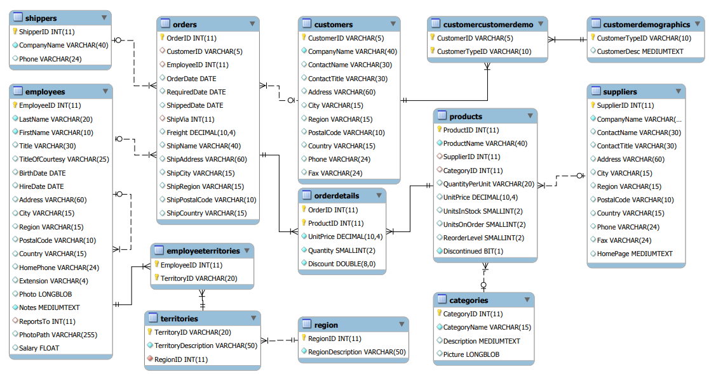

# Set 01 - Problem and Solution on NORTH WIND DB

## ER Diagram



## Challanges

- Return all fields from Table Shippers

```
select * from shippers;
```

- Select only two columns from Categories table.

```
select CategoryName, Description from Categories;
```

- Fetch first name lastname and hiredate of employees whose title is Sales Representative.

```
select FirstName, LastName, HireDate from Employees where Title like 'Sales Representative';
```

- Fetch first name lastname and hiredate of employees whose title is Sales Representative and live in USA.

```
select FirstName, LastName, HireDate from Employees where Title like 'Sales Representative' and Country = 'USA';
```

- Show all orders from specific Employee (id=5)

```
select * from Orders where employeeid = 5;
```

- For suplier print SupplierID, ContactName and ContactTitle where ContactTitle is not Marketing Manager

```
select SupplierID, ContactName, ContactTitle from Suppliers where ContactTitle <> 'Marketing Manager';
```

> NOTE: One can also use '!=' in place of '<>'

- Products table print ProductID and ProductName where ProductName include 'queso'

```
select ProductID, ProductName from Products where ProductName like '%queso%';
```

- View OrderID, CustomerID and ShipCountry from Orders where ShipCountry is either France or Belgium.

```
select OrderID, CustomerID, ShipCountry from Orders where ShipCountry = 'France' or ShipCountry = 'Belgium';
```

- View OrderID, CustomerID and ShipCountry from Orders where ShipCountry is any South American country ('Brazil', 'Mexico', 'Argentina', 'Venezuela')

```
select OrderID, CustomerID, ShipCountry from Orders where ShipCountry IN ('Brazil', 'Mexico', 'Argentina', 'Venezuela');
```

- For all employee show them with FirstName, LastName, Title and BirthDate but order result by BirthDate so that oldest employee shown first.

```
select FirstName, LastName, Title, BirthDate from Employees order by BirthDate ASC;
```

- In previous query extract only date portion of Birthdate and omit time portion.

```
select FirstName, LastName, Title, CAST(BirthDate AS DATE) as BirthDate from Employees order by BirthDate ASC;
```

- Create Fullname by concatinating first and lastname name.

```
select CONCAT(FirstName, ' ', LastName) as Fullname from Employees;
```

OR
```
select FirstName + ' ' + LastName as Fullname from Employees;
```

OR

```
select Fullname = FirstName + ' ' + LastName from Employees;
```

- From Order Details calculate Total Price from UnitPrice and Quantity.

```
select OrderID, UnitPrice, Quantity, (UnitPrice * Quantity) as TotalPrice from [Order Details];
```

OR
```
select Top 10 OrderID, UnitPrice, Quantity, (UnitPrice * Quantity) as TotalPrice from [Order Details]; (Top 10)
```

- How many customer we have.

```
select count(*) AS TotalCustomer from Customers;
```

- Date of the first order.

```
select Top 1 OrderDate from Orders order by OrderDate ASC;
```

OR

```
select MIN(OrderDate) from Orders;
```

- Show countries where there is customer.

```
select DISTINCT country from Customers;
```

- Show all ContactTitle and count for each from Customer.

```
select ContactTitle, count(*) AS Total from Customers group by ContactTitle order by Total;
```

- For each product we want to show ProductID, ProductName and CompanyName of Supplier of the product. Also sort result by Productid.

```
select ProductID, ProductName, CompanyName from Products join Suppliers on Products.supplierid = Suppliers.supplierid order by ProductID;
```

OR

```
select ProductID, ProductName, CompanyName from Products, Suppliers where Products.supplierid = Suppliers.supplierid order by ProductID;
```

- Show orders details OrderID, OrderDate along with shippers CompanyName. Result should be shorted by OrderID and only list order with Orderid less than 10300.

```
select OrderID, OrderDate, CompanyName from Orders JOIN Shippers ON Orders.ShipVia = Shippers.ShipperID where OrderID < 10300 order by OrderID;
```

- Total number of product in each catagory and sort result by it in descending order.

```
select CategoryID, count(*) AS TotalPerCatagory from Products group by CategoryID order by TotalPerCatagory DESC;

select Categories.CategoryName, PC.TotalPerCatagory from Categories JOIN (select CategoryID, count(*) AS TotalPerCatagory from Products group by CategoryID) as PC ON Categories.CategoryID = PC.CategoryID order by 2 DESC;
```

- Find total number of customer per country and city.

```
select Country, City, COUNT(*) AS TotalCustomer from Customers group by Country, City order by TotalCustomer;
```

- Find Products which need to be reordered, i.e. UnitsInStock less than ReorderLevel, ignoring UnitsInOrders and discontinued and order result by ProductID.

```
select ProductID, UnitsInStock, ReorderLevel from Products where UnitsInStock < ReorderLevel order by ProductID;
```

- Find Products which need to be reordered, logic is as below

UnitsInStock + UnitsOnOrder <= ReorderLevel 

also the Product should not be disconitnued.

```
select ProductID, ProductName, UnitsInStock, UnitsOnOrder, ReorderLevel, Discontinued from Products where (UnitsInStock + UnitsOnOrder) <= ReorderLevel and Discontinued = 0 order by ProductID;
```

- List of all customer shorted by region (alphabetically) but keep null region customer at the end and same region customer should be sorted by CustomerID

```
select CustomerID, Region from (select CASE WHEN Region IS NULL THEN 1 ELSE 0 END AS DUMMY, CustomerID, Region from Customers order by DUMMY, Region, CustomerID) as C;
```

OR

```
select CustomerID, Region from Customers order by CASE WHEN Region IS NULL THEN 1 ELSE 0 END, Region, CustomerID;
```

- Top 3 ship country with highest average flieght overall in descending order or average flieght.

```
select TOP 3 ShipCountry, AVG(Freight) AS AVG_Freight from orders group by ShipCountry order by AVG_Freight DESC;
```

- Top 3 ship countries with average flieght overall only for orders 1996 in descending order or average flieght.

```
select TOP 3 ShipCountry, AVG(Freight) AS AVG_Freight from orders where YEAR(OrderDate) = 1996 group by ShipCountry order by AVG_Freight DESC;
```

- Show EmployeeID, LastName, OrderID, ProductName and Quantity for all orders and sort them on OrderID, ProductID.

```
select orders.OrderID, [Order Details].ProductID, orders.EmployeeID, LastName, Products.ProductName, Quantity 
from orders JOIN employees ON orders.EmployeeID = employees.EmployeeID 
JOIN [Order Details] ON orders.OrderID = [Order Details].OrderID 
JOIN Products ON [Order Details].ProductID = Products.ProductID
order by orders.OrderID, [Order Details].ProductID;
```

- Find customers who never placed any orders.

```
select CompanyName, Customers.CustomerID from Customers LEFT JOIN Orders ON Customers.CustomerID = Orders.CustomerID 
where Orders.CustomerID IS NULL;
```

OR

```
select CompanyName, CustomerID from Customers where CustomerID NOT IN (select DISTINCT CustomerID from Orders)
```

- For employee Margaret Peacock id 4, check all customer who never placed any order with her.

```
select CompanyName, CustomerID from Customers where CustomerID NOT IN 
(select DISTINCT CustomerID from Orders JOIN Employees ON orders.EmployeeID = Employees.EmployeeID where Employees.EmployeeID = 4);
```

- A Find customer who had made atleast one order with total value (not including discount) equal to or more 10000. For year 1998 only.

```
select CustomerID, CompanyName from Customers where CustomerID in
(select DISTINCT Orders.CustomerID
from [Order Details] JOIN Orders ON Orders.OrderID = [Order Details].OrderID
where YEAR(Orders.OrderDate) = 1998 group by Orders.OrderID, Orders.CustomerID
having SUM([Order Details].UnitPrice * [Order Details].Quantity) >= 10000)
```

- B Find order details where customer had made atleast one order with total value (not including discount) equal to or more 10000. For year 1998 only.

```
select Customers.CustomerID, CompanyName, OrderID, TOTALAMOUNT from Customers,
(select Orders.CustomerID AS CustomerID, Orders.OrderID AS OrderID, SUM([Order Details].UnitPrice * [Order Details].Quantity) AS TOTALAMOUNT
from [Order Details] JOIN Orders ON Orders.OrderID = [Order Details].OrderID
where YEAR(Orders.OrderDate) = 1998 group by Orders.OrderID, Orders.CustomerID
having SUM([Order Details].UnitPrice * [Order Details].Quantity) >= 10000) AS OD
where Customers.CustomerID = OD.CustomerID
```

- Find customer who had made order with total value (not including discount) equal to or more 15000. For year 1998 only.

```
select Customers.CustomerID, CompanyName, SUM(TOTALAMOUNT) AS TOTALBYCUSTOMER from Customers,
(select Orders.CustomerID AS CustomerID, Orders.OrderID AS OrderID, SUM([Order Details].UnitPrice * [Order Details].Quantity) AS TOTALAMOUNT
from [Order Details] JOIN Orders ON Orders.OrderID = [Order Details].OrderID
where YEAR(Orders.OrderDate) = 1998 group by Orders.OrderID, Orders.CustomerID) AS OD
where Customers.CustomerID = OD.CustomerID
group by Customers.CustomerID, CompanyName
having SUM(TOTALAMOUNT) >= 15000
```

- Add discount into the mix.

```
select Customers.CustomerID, CompanyName, SUM(TOTALAMOUNT) AS TOTALBYCUSTOMER from Customers,
(select Orders.CustomerID AS CustomerID, Orders.OrderID AS OrderID, SUM([Order Details].UnitPrice * [Order Details].Quantity * (1 - [Order Details].Discount)) AS TOTALAMOUNT
from [Order Details] JOIN Orders ON Orders.OrderID = [Order Details].OrderID
where YEAR(Orders.OrderDate) = 1998 group by Orders.OrderID, Orders.CustomerID) AS OD
where Customers.CustomerID = OD.CustomerID
group by Customers.CustomerID, CompanyName
having SUM(TOTALAMOUNT) >= 15000
```

- Show all order made on the last day of the month.

```
select EmployeeID, OrderID, CAST(OrderDate as Date) AS OrderDate from Orders where CAST(OrderDate as Date) = EOMONTH(OrderDate) order by EmployeeID, OrderID;
```

- Show 10 orders with most number of items in it.

```
select Top 2 PERCENT Orders.OrderID, Count(*) AS TotalItems
from [Order Details] JOIN Orders ON Orders.OrderID = [Order Details].OrderID
group by Orders.OrderID order by TotalItems
```

- Show random 2% of the orders.

```
select Top 2 PERCENT OrderID from Orders order by NEWID();
```

> Note NEWID returns Globally unique value per row.

- Identify orders which has atleast 2 different items in quantity more than 60.

```
select OrderID, Quantity from [Order Details] where Quantity >= 60 group by OrderID, Quantity having count(*) > 1
```

- Show details of the order listed above.

```
select * from Orders where OrderID in (select OrderID from [Order Details] where Quantity >= 60 group by OrderID, Quantity having count(*) > 1)
```

- Find orders which arrive late.

```
select * from Orders where RequiredDate < ShippedDate;
```

- Find out which sales person have more order arriving late.

```
select EmployeeID, count(*) as TotalLateOrder into #LORD from Orders where RequiredDate < ShippedDate group by EmployeeID
select EmployeeID, count(*) as TotalOrder into #TORD from Orders group by EmployeeID 
select #TORD.EmployeeID, #LORD.TotalLateOrder, #TORD.TotalOrder, (#LORD.TotalLateOrder + 0.0 / #TORD.TotalOrder * 100) as PercentageLateOrder from
#LORD JOIN #TORD ON #LORD.EmployeeID = #TORD.EmployeeID
DROP TABLE #LORD
DROP TABLE #TORD
```

> Note how we create Local temporary table with #. [LINK](https://www.red-gate.com/simple-talk/databases/sql-server/t-sql-programming-sql-server/temporary-tables-in-sql-server/)

- In previous query show only 2 digit after decimal point.

```
select EmployeeID, count(*) as TotalLateOrder into #LORD from Orders where RequiredDate < ShippedDate group by EmployeeID
select EmployeeID, count(*) as TotalOrder into #TORD from Orders group by EmployeeID 
select #TORD.EmployeeID, #LORD.TotalLateOrder, #TORD.TotalOrder, CONVERT(decimal(10,2), (#LORD.TotalLateOrder + 0.0 / #TORD.TotalOrder * 100)) as PercentageLateOrder from
#LORD JOIN #TORD ON #LORD.EmployeeID = #TORD.EmployeeID
DROP TABLE #LORD
DROP TABLE #TORD
```

- Catagorize customer based on the amount of order for him/her in 1998. Groups to be created as below
    - Upto 1000
    - From 1000 to 5000
    - From 5000 to 10000
    - Above 10000

```
select Orders.CustomerID AS CustomerID, SUM([Order Details].UnitPrice * [Order Details].Quantity * (1 - [Order Details].Discount)) AS TOTALAMOUNT into #CUSTORD
from [Order Details] JOIN Orders ON Orders.OrderID = [Order Details].OrderID where YEAR(Orders.OrderDate) = 1998 group by Orders.CustomerID

select CustomerID, CONVERT(decimal(15,2), TOTALAMOUNT) as TOTALAMOUNT,
CASE when TOTALAMOUNT <= 1000 then 'UPTO1000' when TOTALAMOUNT between 1000 and 5000 then '1000TO50000' when TOTALAMOUNT between 5000 and 10000 then '5000TO10000' else 'ABOVE10000' END as OrderGroup
from #CUSTORD order by OrderGroup

DROP TABLE #CUSTORD
```

- In above result show Customer group with percentage in each and sort by total in each group.

```
select Orders.CustomerID AS CustomerID, SUM([Order Details].UnitPrice * [Order Details].Quantity * (1 - [Order Details].Discount)) AS TOTALAMOUNT into #CUSTORD
from [Order Details] JOIN Orders ON Orders.OrderID = [Order Details].OrderID where YEAR(Orders.OrderDate) = 1998 group by Orders.CustomerID

select CustomerID, CONVERT(decimal(15,2), TOTALAMOUNT) as TOTALAMOUNT,
CASE when TOTALAMOUNT <= 1000 then 'UPTO1000' when TOTALAMOUNT between 1000 and 5000 then '1000TO50000' when TOTALAMOUNT between 5000 and 10000 then '5000TO10000' else 'ABOVE10000' END as OrderGroup
into #CUSTORDGRP from #CUSTORD order by OrderGroup

select OrderGroup, COUNT(*) AS CountOfGroup, SUM(TOTALAMOUNT) AS SumOfGroup into #CUSTORDGRPAGG from #CUSTORDGRP group by OrderGroup
select SUM(CountOfGroup) AS TOTAL into #CUSTORDGRPTOT from #CUSTORDGRPAGG

select OrderGroup, CONVERT(decimal(10,2), (((CountOfGroup + 0.0)/TOTAL) * 100)) AS PercentageInGroup, SumOfGroup from #CUSTORDGRPAGG, #CUSTORDGRPTOT order by SumOfGroup

DROP TABLE #CUSTORDGRPTOT
DROP TABLE #CUSTORDGRPAGG
DROP TABLE #CUSTORDGRP
DROP TABLE #CUSTORD
```

- List all countries where supplier and customer are based.

```
select distinct country from Suppliers union
select distinct country from Customers
```

- We want to get country tagged as whether they are supplier or customer or both

```
select country, 'Both' AS Type from (select distinct country from Suppliers INTERSECT select distinct country from Customers) AS T1 UNION
select country, 'Suppliers' AS Type from (select distinct country from Suppliers EXCEPT select distinct country from Customers) AS T2 UNION
select country, 'Customers' AS Type from (select distinct country from Customers EXCEPT select distinct country from Suppliers) AS T3
```

- We need country with total Supplier and Customer

```
select TS.country AS SCountry, TC.country AS CCountry, TotalSuppliers, TotalCustomers into #AGGTAB from
(select country, count(*) AS TotalSuppliers from Suppliers group by country) AS TS FULL JOIN
(select country, count(*) AS TotalCustomers from Customers group by country) AS TC ON TS.country = TC.country

select CASE when SCountry IS NULL then CCountry else SCountry END AS Country, TotalSuppliers, TotalCustomers from #AGGTAB
OR
select COALESCE(SCountry, CCountry) AS Country, TotalSuppliers, TotalCustomers from #AGGTAB
```

- From Orders table we need to view the first order for each ShipCountry. For such order we want to see OrderID, CustomerID, OrderDate and ShipCountry.

```
select OrderID, CustomerID, ShipCountry, OrderDate from (select OrderID, CustomerID, ShipCountry, OrderDate, DENSE_RANK() OVER(PARTITION BY ShipCountry ORDER BY OrderDate) as ORDER_TIME from Orders) AS T where ORDER_TIME = 1
```

- Show customer who have made more than one order in 5 day period.

--- Wromg

```
select OrderID, CustomerID, OrderDate, LAG(OrderDate,1) OVER(PARTITION BY CustomerID ORDER BY OrderDate) AS TPOrderDate into #MORD from Orders
select OrderID, CustomerID, DATEDIFF(DAY, TPOrderDate, OrderDate) as DateDiff from #MORD where TPOrderDate IS NOT NULL and DATEDIFF(DAY, TPOrderDate, OrderDate) < 6 order by CustomerID
```

--- Correct

```
select IOrders.CustomerID, IOrders.OrderID as InitailOrder, CONVERT(DATE, IOrders.OrderDate) as InitailOrderDate, NOrders.OrderID as NextOrder, CONVERT(DATE, NOrders.OrderDate) as NextOrderDate
from Orders as IOrders JOIN Orders as NOrders ON IOrders.CustomerID = NOrders.CustomerID
where IOrders.OrderDate < NOrders.OrderDate and DATEDIFF(DAY, IOrders.OrderDate, NOrders.OrderDate) < 6
```
